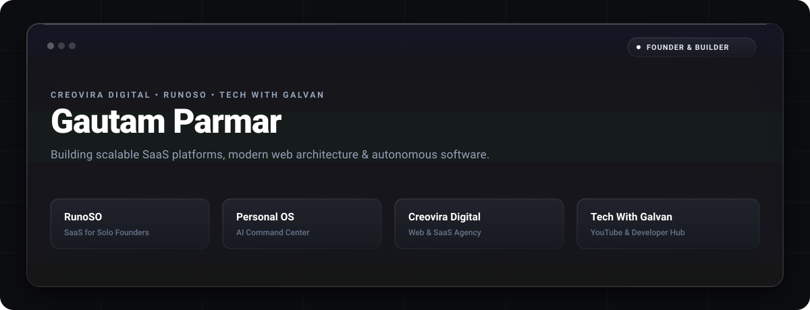

<div align="center">

<!-- Minimalist Dark Grey & White Apple Glass Banner -->


<br/>
<br/>

<!-- Monochromatic Typing SVG -->
<a href="https://techwithgalvan.in">
  
</a>

<br/>

<!-- Minimalist Dark Grey Badges -->
<p align="center">
  <a href="https://linkedin.com/in/galvanmoto"></a>
  <a href="https://youtube.com/@Techwithgalvan"></a>
  <a href="https://instagram.com/itsmegalvan"></a>
  <a href="https://techwithgalvan.in"></a>
  <a href="https://runoso.in"></a>
</p>

</div>

---

### 🚀 About

```yaml
name: Gautam Parmar
role: Founder & Full-Stack / AI Systems Engineer
location: Vadodara, Gujarat, India
current_focus:
  - Scaling RunoSO (SaaS for Solo Founders & Freelancers)
  - Custom Web & SaaS Architecture at Creovira Digital
  - Creating Engineering Content at Tech With Galvan
interests: [Autonomous AI, Minimalist UI/UX, SaaS Engineering, macOS Tooling]
```

---

### 🚀 Products & Platforms

| Product | Link | Category | Description |
|---|---|---|---|
| 🚀 **RunoSO** | [runoso.in](https://runoso.in/) | SaaS Product | All-in-one workspace for solo founders, freelancers & creators |
| 🧠 **Personal OS** | [pos.techwithgalvan.in](https://pos.techwithgalvan.in/) | Web Platform | Autonomous AI command center & intelligence engine |
| 📜 **Script Management** | [sm.techwithgalvan.in](https://sm.techwithgalvan.in/) | Developer Tool | Online script automation & workflow management hub |
| 🍏 **macOS CI/CD Widget** | [macos-cicd-widget](https://github.com/GalvanMoto/macos-cicd-widget) | Open Source / App | Apple-native Menu Bar & Desktop Widget for GitHub Actions monitoring |
| 💼 **Creovira Digital** | [creoviradigital.in](https://creoviradigital.in/) | Agency / Studio | Custom Web, SaaS Development & Digital Growth Agency |
| 🌐 **Tech With Galvan** | [techwithgalvan.in](https://techwithgalvan.in/) | Tech Hub | Development blogs, tutorials & digital resources |

---

### 🛠️ Tech Stack

<p align="center">
  
</p>

---

### 📊 Activity & Streak

<p align="center">
  
</p>

---

### 🌐 Social Hub

| Platform | Link | Description |
|---|---|---|
| 🎥 **YouTube** | [@Techwithgalvan](https://youtube.com/@Techwithgalvan) | Weekly tech breakdowns, coding tutorials & software architecture |
| 📸 **Instagram** | [@itsmegalvan](https://instagram.com/itsmegalvan/) | Behind the scenes, daily dev journey & updates |
| 👔 **LinkedIn** | [in/galvanmoto](https://linkedin.com/in/galvanmoto) | Professional network, startup insights & career updates |

---

<div align="center">
  <sub>Having a great coding life ❤️</sub>
</div>
